# Nordiso Intake Automation

**Proof of concept for automated client intake, quotation and onboarding at Nordiso.**
Built for the IU course *Project: Digitalization and Automation Hackathon* (DLBCCOEDAH01), Phase 2.

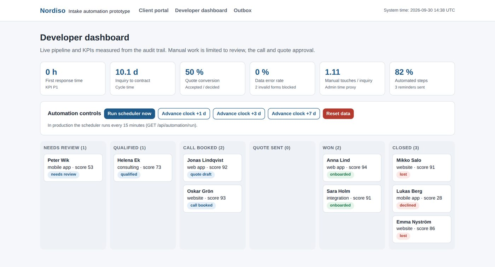

---

## Contents

1. [What this prototype does](#1-what-this-prototype-does)
2. [Quick start (5 minutes)](#2-quick-start-5-minutes)
3. [Guided tour with screenshots](#3-guided-tour-with-screenshots)
4. [How the automation works](#4-how-the-automation-works)
5. [Architecture](#5-architecture)
6. [Tests and simulation](#6-tests-and-simulation)
7. [Project structure](#7-project-structure)
8. [Configuration](#8-configuration)
9. [Troubleshooting](#9-troubleshooting)
10. [Limitations](#10-limitations)

---

## 1. What this prototype does

Before: inquiries arrived by email, web form, LinkedIn and phone, were copied into Excel, quoted from memory and
followed up only when someone remembered. After: one connected flow where the system does the routine work and the
developer only makes three decisions.

| Pain point (As Is) | Automation in this prototype |
|---|---|
| **P1** Four unconnected inquiry channels | One validated intake form with instant confirmation |
| **P2** Client data typed several times | One central client record, entered once by the client |
| **P3** Scheduling calls by email | Self service booking of the discovery call |
| **P4** Quotes estimated from memory | Rule based scoring, AI summary and a PERT estimate |
| **P5** Forgotten follow ups | Automatic reminders on day 3 and 7, expiry on day 14 |
| **P6** Contracts edited by hand | Contract generated from a template, signed online |
| **P7** Invoice data typed again | Deposit invoice pushed to the accounting API |

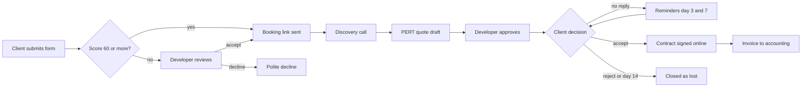

Manual steps (developer) are only: **review grey zone inquiries**, **hold the call**, **approve the quote**.

---

## 2. Quick start (5 minutes)

### Requirements

- [Node.js](https://nodejs.org) version 20 or newer (check with `node -v`)
- No database, no accounts and no API keys are needed

### Run it

Open a terminal in this folder and run:

```bash
npm install        # 1. install dependencies (about 30 seconds)
npm run seed       # 2. load 8 demo clients in different stages
npm run dev        # 3. start the app
```

Then open **http://localhost:3000** in your browser.

| Page | Address | Who uses it |
|---|---|---|
| Start page | http://localhost:3000 | Everyone |
| Client portal | http://localhost:3000/intake | Prospective client |
| Developer dashboard | http://localhost:3000/dashboard | Developer |
| Outbox (all automated messages) | http://localhost:3000/outbox | Developer |

To stop the app press `Ctrl + C` in the terminal. To start over with clean demo data run `npm run seed` again.

---

## 3. Guided tour with screenshots

Follow the steps in order; each step shows which pain point it solves.

### Step 1: Start page

The start page explains the six automation steps and links to both roles.

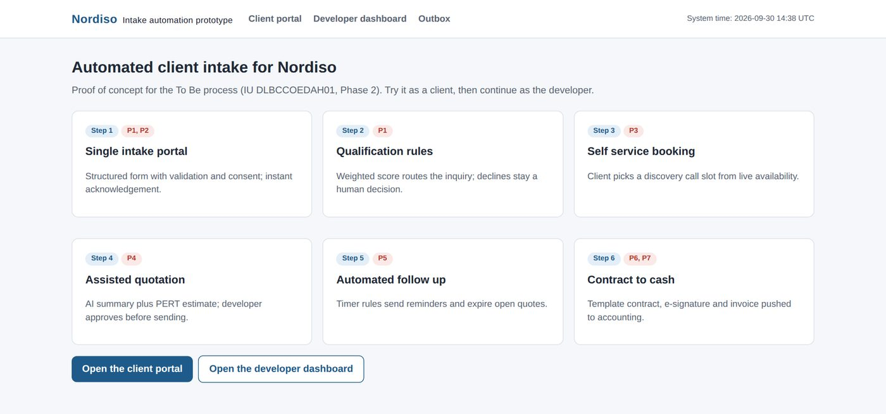

### Step 2: Client submits an inquiry (P1, P2)

Go to **Client portal**. Try sending the form with a wrong email or without consent: the form blocks it and explains
why, so no incomplete record is ever stored.

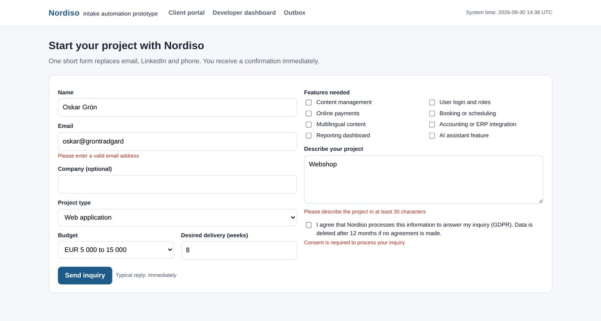

Fill in the form correctly, tick the consent box and send it.

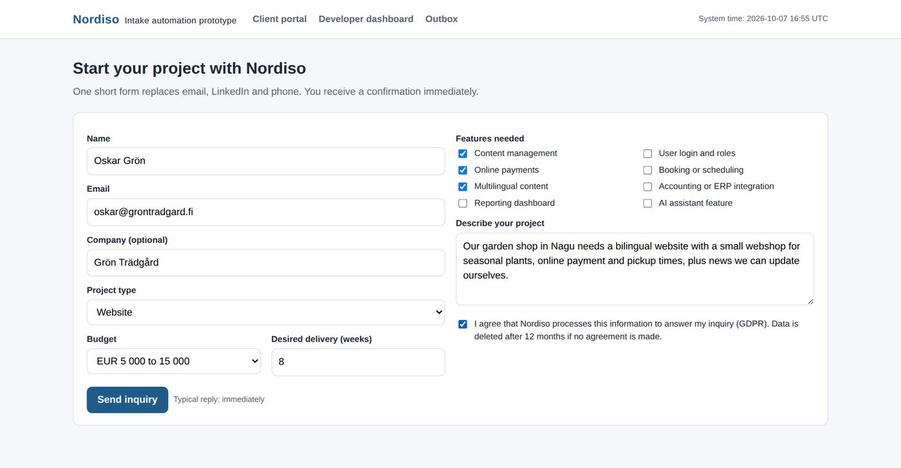

The client receives an instant confirmation (first response time: 0 hours) and, if the inquiry qualifies, a link to
book a call.

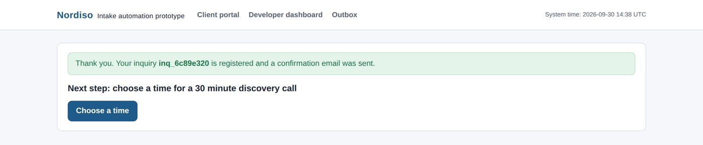

### Step 3: Client books the discovery call (P3)

The client picks a free slot. Booked slots disappear for everyone else, so double booking is impossible.

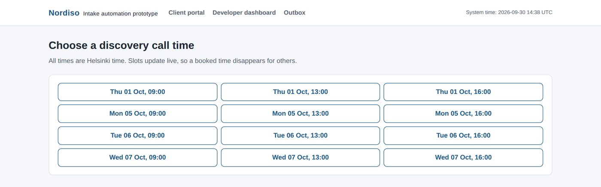

### Step 4: Developer dashboard

Open **Developer dashboard**. The pipeline replaces the Excel log, and the KPI tiles are calculated live from the
audit trail.


| Tile | Meaning |
|---|---|
| First response time | Hours until the client got an answer |
| Inquiry to contract | Days from inquiry to signed contract |
| Quote conversion | Accepted quotes divided by decided quotes |
| Data error rate | Stored records with missing data, plus invalid forms blocked |
| Manual touches per inquiry | Developer actions, a proxy for administrative time |
| Automated steps | Share of process steps done by the system |

### Step 5: Review a grey zone inquiry (human in the loop)

Open **Peter Wik** in the "Needs review" column. The score is between 40 and 59, so the system does not decide alone.
The developer accepts (booking link is sent) or declines (polite email is sent).

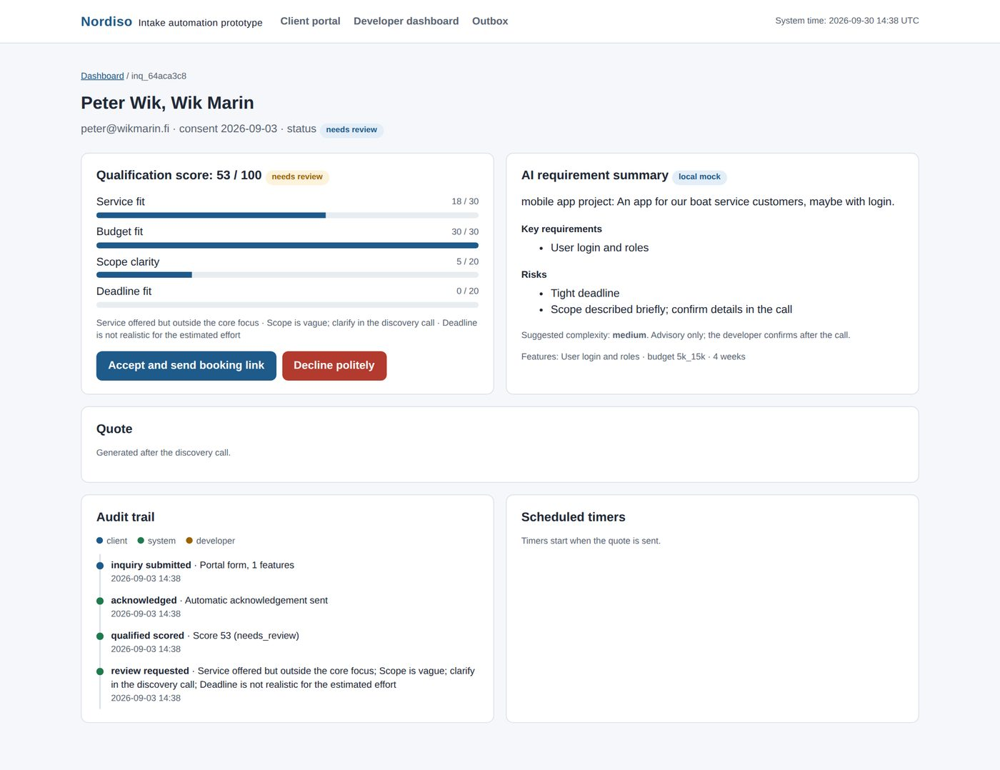

### Step 6: Generate and approve the quote (P4)

Open **Jonas Lindqvist** ("Call booked"). His call is done and a draft quote is already generated. Change the complexity
and click **Recalculate draft** to see the price change. The PERT table shows optimistic, most likely and pessimistic
hours per work package. Check it and click **Approve and send to client**. (For a new inquiry the button is called
**Generate draft quote**.)

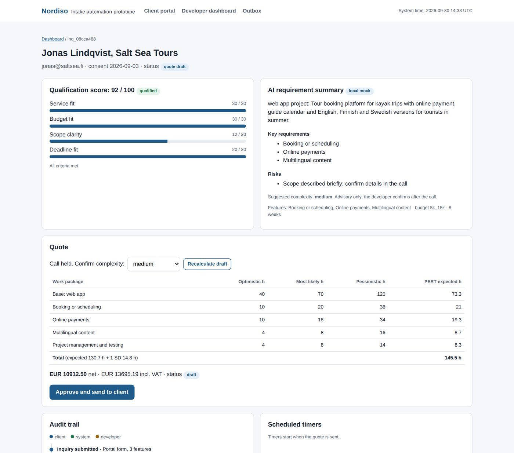

### Step 7: Automatic follow up (P5)

Open **Mikko Salo** ("Closed"). He never answered, so the system sent two reminders and closed the quote after 14 days.
The audit trail shows every step and who did it (client, system or developer).

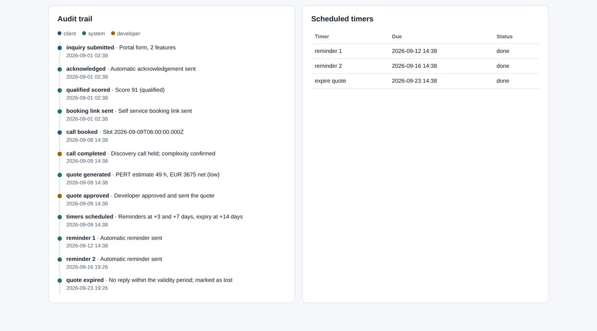

**Try it yourself:** approve a quote, then use **Advance clock +3 d** and **+7 d** on the dashboard and watch the
reminders appear in the Outbox.

### Step 8: Client accepts and signs (P6, P7)

Open the client link of a sent quote (shown on the inquiry page). Click **Accept quote**, type a name and click
**Sign electronically**. The contract is stored with a SHA-256 signature hash, and the deposit invoice is pushed to the
accounting API.

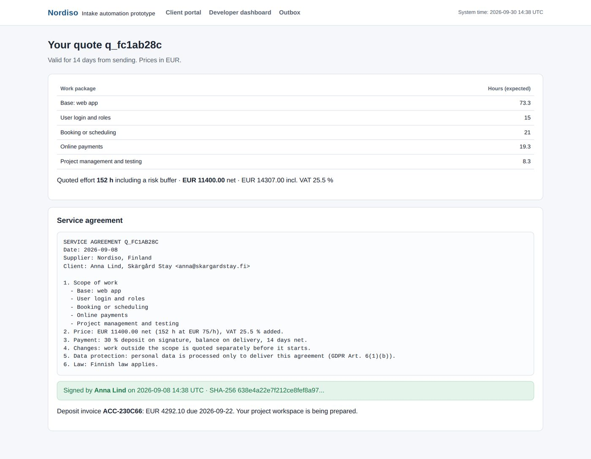

### Step 9: Outbox

Every automated message (confirmation, booking link, quote, reminders, contract, invoice) is logged here. In production
an email service would send them.

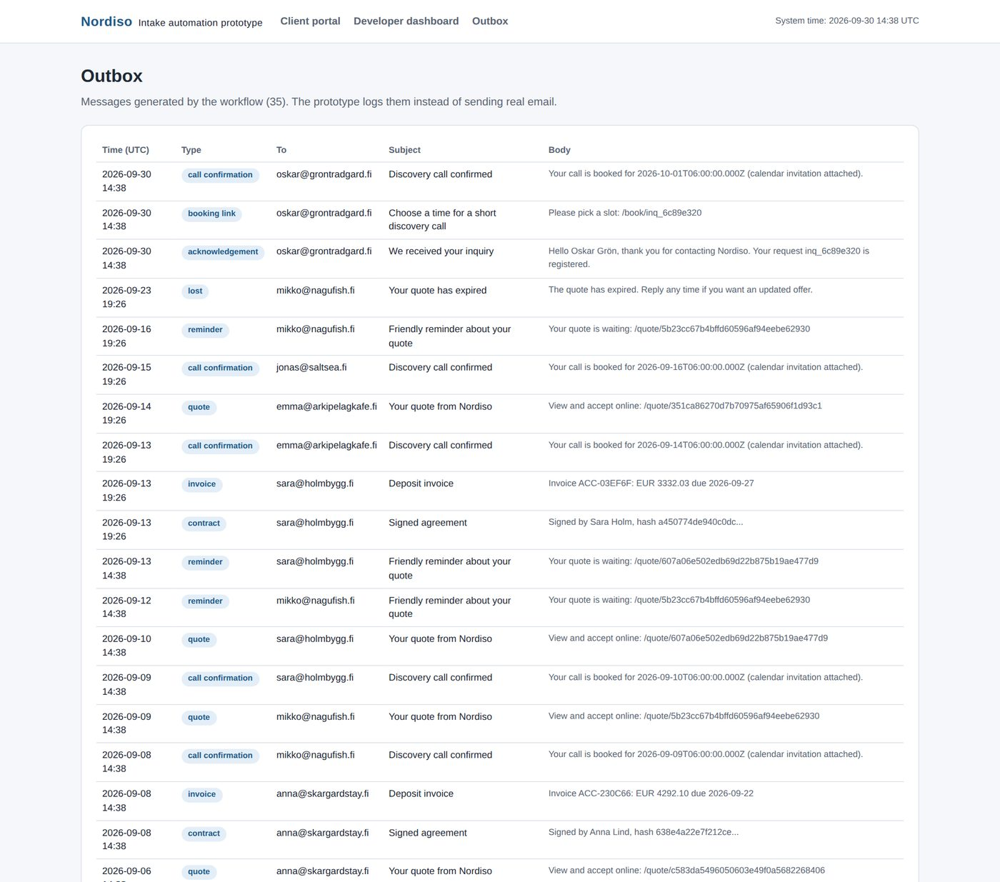

---

## 4. How the automation works

### Qualification rules (score 0 to 100)

| Criterion | Points | Rule |
|---|---|---|
| Service fit | 0 to 30 | Core services score 30, other offered services 18 |
| Budget fit | 0 to 30 | Budget compared with a medium complexity estimate |
| Scope clarity | 0 to 20 | Length of the description plus selected features |
| Deadline fit | 0 to 20 | Requested weeks compared with the estimated effort |

**60 or more:** booking link sent automatically. **40 to 59:** developer reviews.
**Below 40:** decline is only *suggested*; the developer always confirms.

### Quote estimate (PERT)

For every work package: expected hours **E = (a + 4m + b) / 6** and uncertainty **SD = (b − a) / 6**,
where a = optimistic, m = most likely, b = pessimistic hours.
The quote uses the total expected hours **plus one SD** as a risk buffer, times the hourly rate.

### Timer rules (event, condition, action)

| When | Only if | Then |
|---|---|---|
| Quote is sent | always | Schedule reminders (day 3, day 7) and expiry (day 14) |
| Reminder is due | quote still open | Send reminder |
| Expiry is due | quote still open | Close quote as lost and notify client |
| Client decides | always | Cancel all open timers |

In production a cron job calls `GET /api/automation/run` every 15 minutes.

### AI summary

The Claude API turns the client's description into a short summary, key requirements, risks and a complexity
suggestion. It never sets prices or sends messages. Without an API key, a built in local summarizer is used, so the
prototype always works.

---

## 5. Architecture

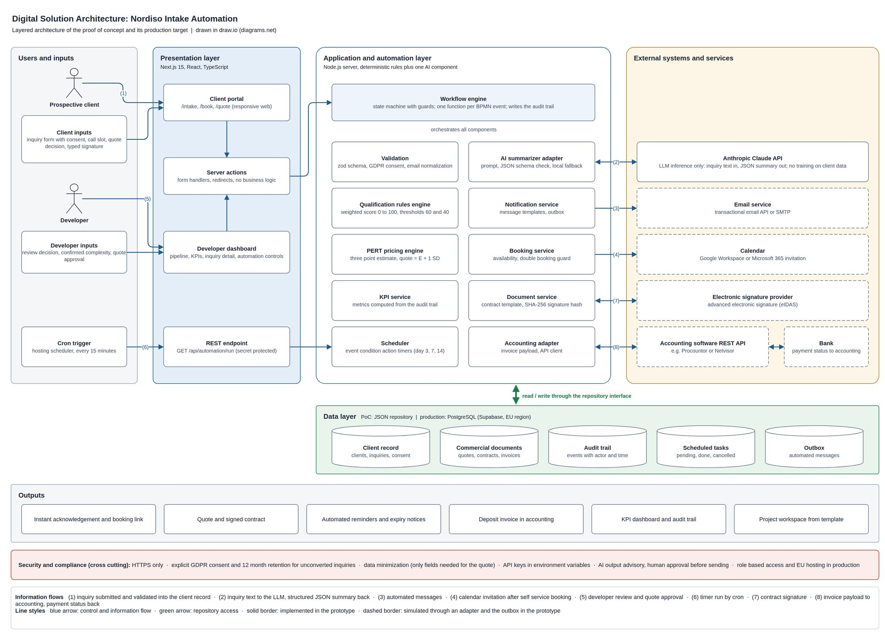

The redesigned To Be process in BPMN 2.0:

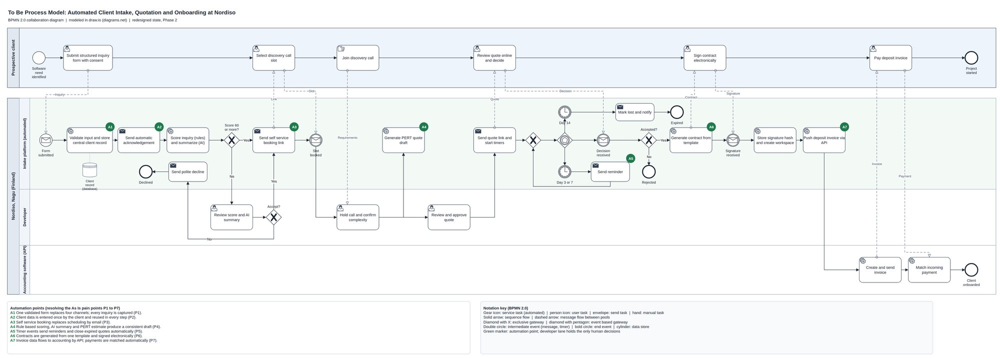

| Layer | Technology |
|---|---|
| Frontend and server | Next.js 15, React 19, TypeScript |
| Validation | zod |
| Workflow and rules | Plain TypeScript modules in `src/lib` |
| Data | JSON file store (`data/db.json`), replaceable by PostgreSQL |
| AI | Anthropic Claude Messages API (optional) |
| Tests | Vitest |

---

## 6. Tests and simulation

```bash
npm test            # 18 automated tests (rules, PERT, validation, timers, full workflow)
npm run typecheck   # strict TypeScript check
npm run coverage    # test coverage of the automation logic (about 94% of statements)
npm run simulate    # seeded simulation of 60 inquiries, results in results/
```

Simulation result (60 submissions, client behavior assumed):

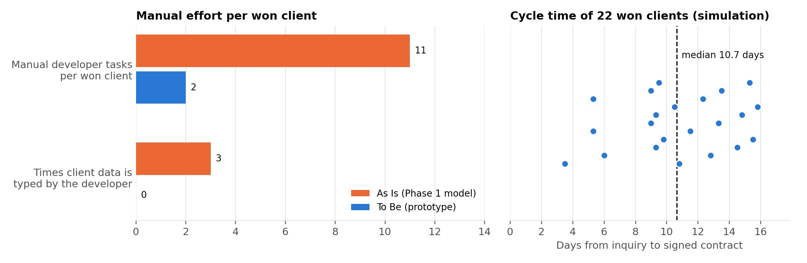

| KPI | Result |
|---|---|
| First response time | 0 hours |
| Incomplete stored records | 0% |
| Quote conversion | 49% |
| Median inquiry to contract | 10.7 days |
| Manual developer tasks per won client | 2 (As Is: 11) |

---

## 7. Project structure

```
src/
  app/                      pages and server actions (Next.js App Router)
    intake/                 client portal form
    book/[id]/              self service booking
    dashboard/              pipeline, KPIs, inquiry detail
    quote/[token]/          client quote, contract and signature
    outbox/                 log of automated messages
    api/automation/run/     scheduler endpoint for a cron job
  lib/
    workflow.ts             workflow engine: one function per process step
    config.ts               business rules: rates, features, thresholds, timers
    kpi.ts                  KPIs computed from the audit trail
    store.ts                data repository (JSON file)
    automation/
      validation.ts         intake form rules and GDPR consent
      qualification.ts      scoring rules
      pricing.ts            PERT estimation
      summarizer.ts         Claude API call with local fallback
      documents.ts          contract, signature hash, accounting adapter
tests/                      Vitest test suites
scripts/                    seed, simulation, screenshots, charts
docs/                       screenshots and diagrams used in this README
```

---

## 8. Configuration

All business settings are in **`src/lib/config.ts`** (hourly rate, VAT, deposit, feature hours, score thresholds,
reminder days, booking times). Change a value, save, and the app uses it immediately.

Optional AI: copy `.env.example` to `.env.local` and add your key:

```bash
ANTHROPIC_API_KEY=your_key_here
```

---

## 9. Troubleshooting

| Problem | Solution |
|---|---|
| `command not found: npm` | Install Node.js 20 or newer from nodejs.org |
| Port 3000 is already in use | Run `npx next dev -p 3001` and open http://localhost:3001 |
| Dashboard is empty | Run `npm run seed` |
| Want a clean start | Click **Reset data** on the dashboard or run `npm run seed` |
| AI summary says "local mock" | Normal without an API key; see Configuration |

---

## 10. Limitations

This is a proof of concept. Email, calendar, electronic signature and accounting are simulated through adapters and
the Outbox, data is stored in a local JSON file, and the dashboard has no login. Prices and hours are illustrative
settings. The adapters are designed so real services can be connected without changing the workflow.

---

*Masabo Simplice Frank, IU Internationale Hochschule, 2026.*
